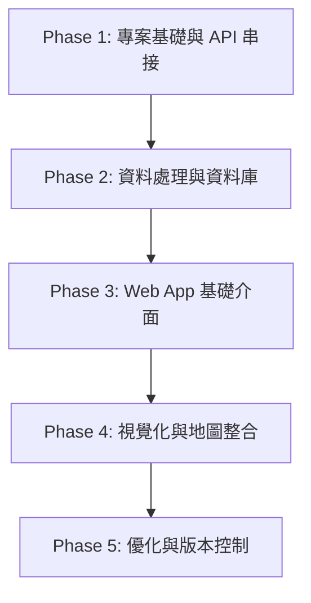

# 📋 專案實作工作流程 (Workflow)

> **專案名稱**: 台灣天氣預報 AI × Data 儀表板 (`Taiwan Weather Dashboard`)  
> **標籤 (Tags)**: `#AI` `#Data` `#CWA_API` `#SQLite` `#Streamlit` `#Folium` `#GitHub`  
> **更新日期**: 2026-09-23

---

## 🧭 24 堂課完整開發步驟路線圖 (Roadmap)

### 🔹 第一階段：專案基礎與 API 串接 (Steps 1–5)
- [x] **Step 1: 課程介紹** — 確定專案目標、學習地圖與成果展示規劃。
- [x] **Step 2: 台灣的天氣與生活** — 了解氣象數據的重要性與決策應用。
- [ ] **Step 3: 中央氣象署 CWA Open Data 平台** — 註冊帳號、取得 API Key 並選擇目標資料集。
- [ ] **Step 4: API 資料取得** — 使用 Python `requests` 模組帶入 Authorization Header 抓取 JSON。
- [ ] **Step 5: JSON 資料結構解析** — 剖析多層級 JSON 結構，定位氣溫資料 (`Mint`, `MaxT`)。

---

### 🔹 第二階段：資料整理與資料庫設計 (Steps 6–10)
- [ ] **Step 6: 提取最高與最低氣溫** — 轉換並抽取時間序列與各區域氣溫數值。
- [ ] **Step 7: 資料整理與預覽** — 利用 `Pandas` 整理成結構化 DataFrame (包含 regionName, dataDate, minT, maxT)。
- [ ] **Step 8: 建立 SQLite 資料庫** — 使用 `sqlite3` 建立本地 `data.db` 資料庫。
- [ ] **Step 9: 資料庫 Schema 設計** — 建立 `TemperatureForecasts` 資料表與主鍵、欄位型別設定。
- [ ] **Step 10: 查詢資料驗證** — 撰寫 SQL 查詢 (`SELECT`, `WHERE`) 驗證寫入資料之正確性。

---

### 🔹 第三階段：Streamlit Web App 介面開發 (Steps 11–16)
- [ ] **Step 11: Streamlit 入門** — 建立環境、撰寫基本框架與 Hello World 頁面。
- [ ] **Step 12: 從資料庫讀取資料** — 整合 `sqlite3` 與 `pandas.read_sql_query` 在 App 中載入資料。
- [ ] **Step 13: 下拉選單選擇地區** — 使用 `st.selectbox` 提供北部、中部、南部、東部等地區選擇。
- [ ] **Step 14: 繪製折線圖** — 使用 Plotly / Matplotlib 繪製一週最高與最低溫雙軸折線圖。
- [ ] **Step 15: 顯示資料表格** — 使用 `st.dataframe` 清晰呈現每日詳細數據。
- [ ] **Step 16: 整合 Web App 介面** — 調整 Layout 欄位 (`st.columns`) 與風格排版。

---

### 🔹 第四階段：進階視覺化與地圖整合 (Steps 17–19)
- [ ] **Step 17: 進階：台灣地圖視覺化** — 整合 `Folium` + `streamlit-folium` 繪製全台區域氣溫分布圖。
- [ ] **Step 18: 選擇日期顯示地圖** — 新增日期選擇器 (`st.date_input`) 實現動態氣溫地圖。
- [ ] **Step 19: 完整成果展示** — 整合全功能儀表板 (`Taiwan Weather Dashboard`)。

---

### 🔹 第五階段：程式優化、版本控制與延伸 (Steps 20–24)
- [x] **Step 20: 程式碼品質與優化** — 模組化設計、例外處理與模組註解。
- [x] **Step 21: 專案上傳至 GitHub** — Git 版本控制、Commit & Push 至遠端儲存庫 (`dennis6651259-hub/0923`)。
- [ ] **Step 22: 延伸應用與想法** — 天氣提醒 Line Bot、旅遊行程建議、農業防害應用。
- [ ] **Step 23: 回顧與重點整理** — 複習 API -> JSON -> SQLite -> Streamlit 全流程。
- [ ] **Step 24: 下一步：繼續探索** — 探索更多 Open API 與 AI 輔助實作。
