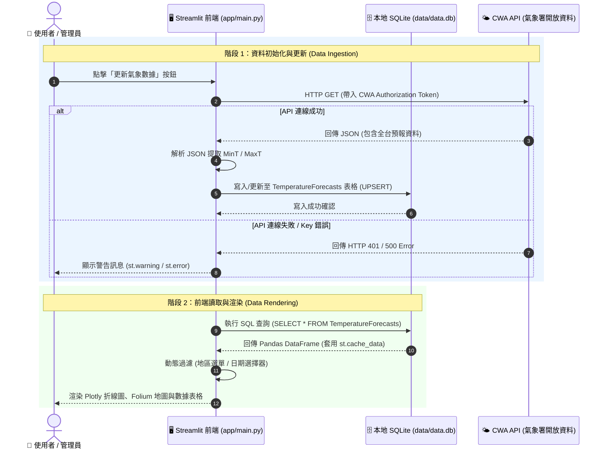
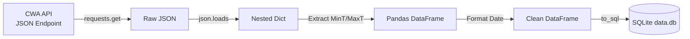
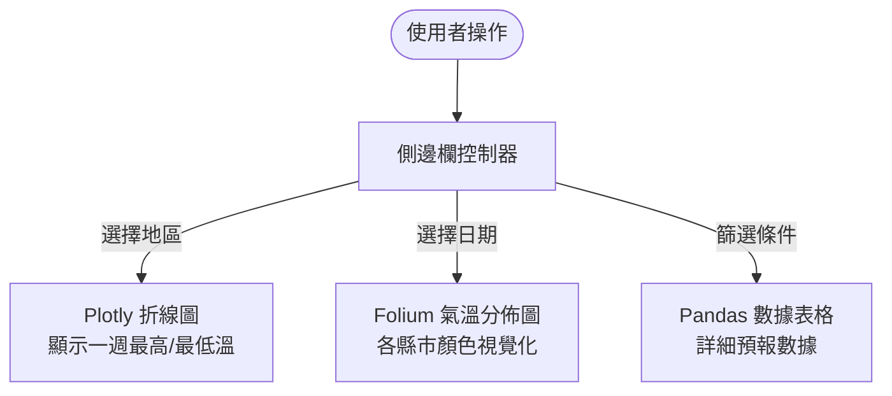

# 🔄 專案開發與資料處理工作流程文件 (workflow.md)

> **專案名稱**: 台灣氣象預報 AI × Data 儀表板 (`Taiwan Weather Dashboard`)  
> **文件版本**: v1.0.0  
> **更新日期**: 2026-09-23  
> **標籤 (Tags)**: `#Workflow` `#DataPipeline` `#Streamlit` `#CWA_API` `#SQLite`

---

## 1. 🌐 全系統實體工作流程圖 (System Execution Workflow)



---

## 2. 📑 5 大階段詳細工作流程與實作規範

### 📌 階段一：環境建置與套件準備 (Setup & Environment)

* **輸入 (Input)**: Python 3.10+ 環境
* **處理步驟 (Process)**:
  1. 初始化專案資料夾結構 (`app/`, `data/`, `assets/`, `myplan/`)
  2. 設定 `.gitignore` 排除敏感資訊 (`.env`, `*.db`, `__pycache__`)
  3. 撰寫 `requirements.txt` 指定必要套件：`requests`, `pandas`, `streamlit`, `folium`, `streamlit-folium`, `plotly`
* **輸出 (Output)**: 乾淨且版本控制健全的基礎架構

---

### 📌 階段二：API 資料擷取與清理管道 (Data Pipeline & ETL)



* **處理細節**:
  - **API 模組 (`app/utils/cwa_api.py`)**: 封裝 `fetch_weather_data(api_key)` 函式。
  - **資料清洗**:
    - 轉譯 CWA 縣市名稱與區域分類 (北部/中部/南部/東部/離島)。
    - 時間欄位統一化為 `YYYY-MM-DD` 格式。
    - 數值轉換為浮點數 `float`。

---

### 📌 階段三：資料庫管理與快取 (Database & Caching)

* **資料庫模組 (`app/utils/db_helper.py`)**:
  - `init_db()`: 檢查並建立 `TemperatureForecasts` 資料表。
  - `save_forecasts(df)`: 使用 `INSERT OR REPLACE INTO` 確保數據最新且不重複。
  - `load_forecasts(region=None)`: 讀取數據並提供給前端。
* **Streamlit 快取機制**:
  - 於讀取函式加上 `@st.cache_data(ttl=3600)`，減少 DB 操作，提升響應速度。

---

### 📌 階段四：互動式 UI/UX 與視覺化 (Frontend & Visualization)



* **組件結構**:
  - **折線圖 (`app/components/charts.py`)**: Plotly 雙線圖 (Red: 最高溫, Blue: 最低溫)。
  - **地圖 (`app/components/map.py`)**: Folium 畫出台灣圖層，以 Marker/GeoJSON 標示各地區氣溫。

---

### 📌 階段五：版本控制與 CI/CD 推送 (Git & Deployment)

1. **本地測試 (Local Testing)**:
   ```bash
   streamlit run app/main.py
   ```
2. **Git Commit 規範**:
   - `init`: 初始架構建立
   - `feat`: 新增 API 串接 / 頁面元件
   - `fix`: 修復資料解析或 UI 錯誤
   - `docs`: 更新說明文件 (README, design.md, workflow.md)
3. **GitHub 自動同步**:
   ```bash
   git add .
   git commit -m "feat: 完成氣象資料管道與 Streamlit UI 整合"
   git push origin main
   ```

---

## 3. ⚠️ 例外狀況處理流程 (Exception Handling Workflow)

| 異常類型 | 觸發情境 | 處理機制 | 提示方式 |
|---------|---------|---------|---------|
| **API Key 無效** | HTTP 401 / 未輸入 | 攔截例外，切換至本機快取資料或示範數據 | `st.warning("請於側邊欄輸入有效的 CWA API Key")` |
| **網路連線中斷** | Timeout / DNS 失敗 | 自動重新嘗試 3 次，失敗後載入 SQLite 歷史紀錄 | `st.error("網路連線失敗，目前顯示歷史快取數據")` |
| **資料庫鎖定** | SQLite Busy | 使用 Context Manager (`with conn:`) 確保連線自動釋放 | 自動重試 / Log 記錄 |

---

## 4. 🎯 驗證與 Check List (Workflow Verification)

- [x] 專案資料夾與基礎環境建置
- [x] Git 設定與 GitHub 遠端庫連結
- [x] 系統架構設計文件 (`design.md`) 撰寫
- [x] 完整工作流程文件 (`workflow.md`) 撰寫
- [ ] CWA API 串接與數據清洗測試
- [ ] SQLite 資料庫寫入驗證
- [ ] Streamlit 折線圖與 Folium 地圖呈現
- [ ] 最終上線與全功能驗證
