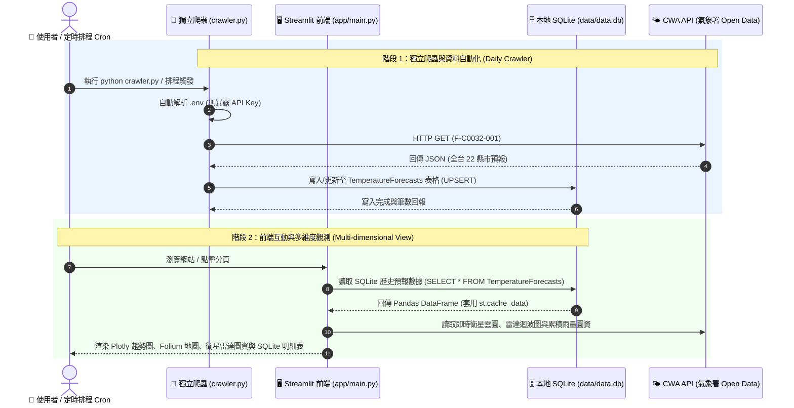

# 🔄 專案開發與資料處理工作流程文件 (workflow.md)

> **專案名稱**: 台灣氣象預報 AI × Data 儀表板 (`Taiwan Weather Dashboard`)  
> **文件版本**: v1.1.0  
> **更新日期**: 2026-09-23  
> **標籤 (Tags)**: `#Workflow` `#DataPipeline` `#Crawler` `#Satellite` `#Streamlit` `#CWA_API` `#SQLite`

---

## 1. 🌐 全系統實體工作流程圖 (System Execution Workflow)

---

## 2. 📑 5 大階段詳細工作流程與實作規範

### 📌 階段一：環境建置與 API 安全隱私設定
* **輸入 (Input)**: `.env` 設定檔 (`CWA_API_KEY=...`)
* **處理步驟 (Process)**:
  1. 確保 `.env` 被包含在 `.gitignore` 中，金鑰零外洩。
  2. 移除網頁前端側邊欄 API Key 輸入框，僅保留安全綠色連線標籤 `🟢 CWA API 狀態: 已配對 (.env)`。

---

### 📌 階段二：獨立每日自動爬蟲 (`crawler.py`)
* **處理步驟 (Process)**:
  1. 執行 `python crawler.py`。
  2. 自動載入 `.env` 金鑰。
  3. 呼叫 `cwa_api.fetch_weather_forecast()` 抓取 22 縣市 66 筆預報。
  4. 寫入 SQLite `data/data.db`。
  5. 輸出簡明執行日誌與筆數統計。

---

### 📌 階段三：資料庫管理與快取 (`db_helper.py`)
* **處理步驟 (Process)**:
  - 自動建置 `TemperatureForecasts` 表。
  - `INSERT OR REPLACE INTO` 確保數據更新且無重複鍵。

---

### 📌 階段四：多維度視覺化觀測與圖資整合
* **分頁規劃**:
  1. **📈 氣溫趨勢圖**: Plotly 雙軸最高/最低溫折線圖 + 降雨機率。
  2. **🗺️ 全台氣溫地圖**: Folium 互動氣溫分布地圖。
  3. **🛰️ 衛星與雷達觀測**: CWA 官方東亞紅外線雲圖、台灣真實色衛星圖、全台雷達迴波合成圖、日累積雨量分布圖。
  4. **🗄️ SQLite 數據明細**: 表格檢視與 CSV 匯出。

---

### 📌 階段五：版本控制與推送到 GitHub
1. 本地執行測試 `python crawler.py` 及 `streamlit run app/main.py`。
2. Git 提交與推送到遠端倉庫 `dennis6651259-hub/0923`。
